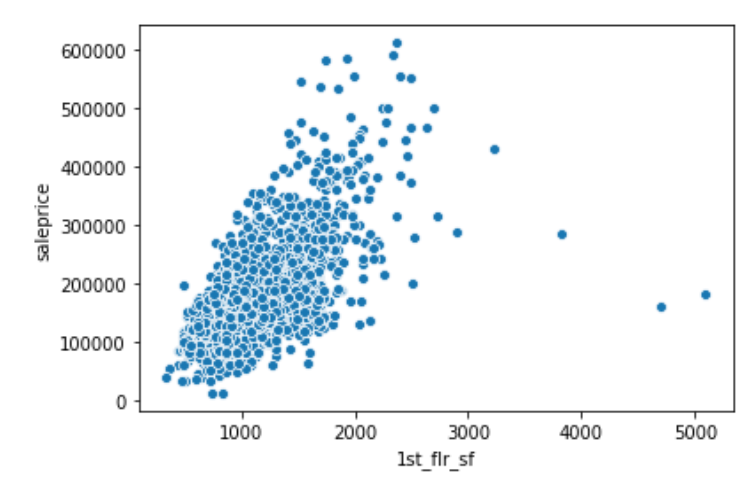

# Ames Housing Price Prediction Model Recommendation

_Justin August_

## Problem statement

Zillow is moving into a new market and needs a new algorithm to effectively price houses based on their data. Currently the company has metadata for over 2,000 homes with 80 columns of data for each home.

The goal is to develop an algorithm to be used in a production application to estimate the price of a home based on metadata about the property & determine the potential for generalizability.

## Data
    
- [Ames Housing Data](./data/train.csv) ([source](https://www.kaggle.com/c/dsi-us-9-project-2-regression-challenge/data))

	This data includes housing features and sale prices for houses in Ames, Iowa. A full data dictionary can be found [here](https://www.kaggle.com/c/dsi-us-9-project-2-regression-challenge/data).

Target Variable: `logsaleprice`

The `saleprice` feature was not normally distributed so the natural `log()` was applied to it to create an evenly distributed target.

## Data Cleaning & EDA

### Imputing & NA Filling
Give Flowchart of cleaning and processing

|Categorical Columns|Numerical Columns|
|---|---|
|`alley`, `mas_vnr_type`, `bsmt_qual`, `bsmt_cond`, `bsmt_exposure`, `bsmtfin_type_1`, `bsmtfin_type_2`, `fireplace_qu`, `garage_type`, `garage_finish`, `garage_qual`, `garage_cond`, `pool_qc`, `fence`, `misc_feature`|`lot_frontage`, `mas_vnr_area`, `bsmtfin_sf_1`, `bsmtfin_sf_2`, `bsmt_unf_sf`, `total_bsmt_sf`, `bsmt_full_bath`, `bsmt_half_bath`, `garage_yr_blt`, `garage_cars`, `garage_area`|
|These were filled with information from the Data Dictionary. Most of the missing values were due to the way the data was interpreted by PANDAS|These were either set to `0` for descriptive features and set to ranked `0-5` for ordinal features|

### Outlier Detection
There were some outliers in terms of square footage and it's relationship to sale price. I decided to remove them.

<preview>

`1st_flr_sf`
</preview>
**With Outliers**

**Without Outliers**

<preview>

Other outliers
</preview>
**With Outliers**

**Without Outliers**

### Initial feature identification

<preview>

Correlation of `>=` .3 to `saleprice`
</preview>

### Examining the Distributions & Linearity of Potential Features
Distributions & Linearity of the potential features were checked.

<preview>

**Distributions & Linearity**
</preview>

<preview>

**Linearity With `saleprice`**
</preview>

<preview>

**Quality and Condition features by `saleprice`**
</preview>
*Green means greater than the `np.mean()` of `saleprice`*

##Modeling
### Iterative Model Generation
Starting with the top list of correlations, iterations of the model was made, including some transformations and interactions of features.

|Model id|Estimator|# of features|Target|Scaled|R2 Training|R2 Test|R2 Cross Validation|
|---|---|---|---|---|---|---|---|
|1|OLS|17|`saleprice`|No|0.882|0.825|0.878|
|2|OLS|27|`saleprice`|No|0.896|0.837|0.888|

Some of these features had skewed distributions. In order to normalize them the `log()` was taken for each.
<preview>

`bsmtfin_sf_1`, `mas_vnr_area`, `1st_flr_sf`, `gr_liv_area`, `overall_qual`, `open_porch_sf`
</preview>
**Pre-log**

**Post-log**

Checking the distribution of `saleprice` I realized that it also had a positive skew. In order to correct this I converted it into `logsaleprice` and used it as the target.

Some details were then re-tried

|Model id|Estimator|# of features|Target|Scaled|R2 Training|R2 Test|R2 Cross Validation|
|---|---|---|---|---|---|---|---|
|3|OLS|27|`saleprice`|No|0.905|0.879|0.900|
|4|OLS|28|`logsaleprice`|No|0.907|0.883|0.902|
|5|OLS|28|`logsaleprice`|No|0.907|0.883|0.902|

## Revisting EDA with Categorical & Ordinal Features
Checking the categorical features by average `saleprice`. I used this to identify categorical and ordinal features to include in the model similar to my earlier correlations.
<preview>

Categoricals & Ordinals
</preview>
*Green indicates the average `saleprice` is at least 10% higher than the `mean()`.

**These features were then turned into 1 Hot/Dummy variables to include in the model**

## Final OLS Model
|Model id|Estimator|# of features|Target|Scaled|R2 Training|R2 Test|R2 Cross Validation|
|---|---|---|---|---|---|---|---|
|6|OLS|28|`logsaleprice`|No|0.908|0.887|0.903|

## Scaling, Ridge, Lasso and RandomForests
In order to adjust the fit of the model and balance the bias/variability (showing a bit more bias than preferred at this point), regularlization and optimization of features via RandomForests was utilized.

|Model id|Estimator|# of features|Target|Scaled|R2 Training|R2 Test|R2 Cross Validation|
|---|---|---|---|---|---|---|---|
|7|OLS|28|`logsaleprice`|Yes|0.908|0.887|0.903|
|8|LassoCV|28|`logsaleprice`|Yes|0.908|0.887|0.903|
|9|RidgeCV|28|`logsaleprice`|Yes|0.908|0.887|0.903|
|10|Random Forest & RidgeCV||`logsaleprice`|Yes|0.924|-4.76|-1474918909317527.0|
|11|Random Forest & LassoCV||`logsaleprice`|Yes|0.924|-4.76|0.0001|
|12|Polynomial Transform & Random Forest & RidgeCV|107|`logsaleprice`|Yes|0.910|0.866|0.882|

## Key takeaways:
An Ordinary Least Squares model is effective at accounting for 88-90% of the variation in the `logsaleprice` of a home. This is a decent but perhaps not ideal predictive model.

Attempting to use other concepts on this data was not success for me. None of these created a better performing model and perhaps contributed to overfitting.

<preview>

Model Performance by Iteration
</preview>

|Model id|Estimator|# of features|Target|Scaled|R2 Training|R2 Test|R2 Cross Validation|
|---|---|---|---|---|---|---|---|
|1|OLS|17|`saleprice`|No|0.882|0.825|0.878|
|2|OLS|27|`saleprice`|No|0.896|0.837|0.888|
|3|OLS|27|`saleprice`|No|0.905|0.879|0.900|
|4|OLS|28|`logsaleprice`|No|0.907|0.883|0.902|
|5|OLS|28|`logsaleprice`|No|0.907|0.883|0.902|
|6|OLS|28|`logsaleprice`|No|0.908|0.887|0.903|
|7|OLS|28|`logsaleprice`|Yes|0.908|0.887|0.903|
|8|LassoCV|28|`logsaleprice`|Yes|0.908|0.887|0.903|
|9|RidgeCV|28|`logsaleprice`|Yes|0.908|0.887|0.903|
|10|Random Forest & RidgeCV||`logsaleprice`|Yes|0.924|-4.76|-1474918909317527.0|
|11|Random Forest & LassoCV||`logsaleprice`|Yes|0.924|-4.76|0.0001|
|12|Polynomial Transform & Random Forest & RidgeCV|107|`logsaleprice`|Yes|0.910|0.866| |

| | OLS Model|Ridge & Random Forest Feature Selection|
|-----|-----|-----|
|Untouched Features|21|4|
|Transformed Features|5|11|
|Interaction Features|2|92|

<preview>

OLS Features
</preview>
`bsmtfin_sf_1`,
`heating_qc`,
`fireplace_qu`,
`year_built`,
`bsmt_qual`,
`1st_flr_sf`,
`garage_area`,
`kitchen_qual`,
`gr_liv_area`,
`exter_qual`,
`overall_qual`,
`porches`,
`baths`,
`open_porch_sf`,
`full_bath`,
`lot`,
`lot_area`,
`overall_cond`,
`bsmtfin_sf_1`,
`2nd_flr_sf`,
`half_bath`,
`total_bsmt_sf`,
`fireplaces`,
`year_remod/add`,
`central_air_y`,
`neighborhood_nridght`,
`neighborhood_stonebr`,
`neighborhood_noridge`

<preview>

Ridge & Random Forest Feature Selection Predictive Features
</preview>
`lot_frontage`, `lot_area`, `alley`, `year_built`, `ms_zoning lot_shape`, `ms_zoning bldg_type`, `ms_zoning bsmtfin_sf_2`, `lot_frontage^2`, `lot_frontage lot_shape`, `lot_frontage land_slope`, `lot_frontage bldg_type`, `lot_frontage overall_cond`, `lot_frontage year_built`, `lot_frontage foundation`, `lot_frontage bsmt_cond`, `lot_frontage bsmtfin_sf_2`, `lot_area^2`, `lot_area lot_shape`, `lot_area utilities`, `lot_area condition_1`, `lot_area bldg_type`, `lot_area overall_cond`, `lot_area year_remod/add`, `lot_area foundation`, `lot_area bsmt_cond`, `lot_area bsmtfin_sf_1`, `lot_area bsmtfin_type_2`, `lot_area bsmtfin_sf_2`, `lot_area bsmt_unf_sf`, `street bsmtfin_sf_2`, `street bsmt_unf_sf`, `alley^2`, `alley lot_shape`, `alley land_slope`, `alley bldg_type`,  `alley overall_cond`, `alley year_remod/add`, `alley foundation`, `alley bsmt_cond`, `alley bsmtfin_type_2`, `alley bsmtfin_sf_2`, `lot_shape^2`, `lot_shape condition_1`, `lot_shape bldg_type`, `lot_shape overall_cond`, `lot_shape year_built`, `lot_shape year_remod/add`, `lot_shape mas_vnr_area`, `lot_shape exter_qual`, `lot_shape bsmtfin_sf_1`, `lot_shape bsmtfin_sf_2`, `lot_shape bsmt_unf_sf`, `utilities^2`,  `utilities condition_1`, `utilities bldg_type`, `utilities year_remod/add`, `utilities foundation`, `utilities bsmtfin_sf_2`, `land_slope overall_cond`, `land_slope year_built`, `land_slope year_remod/add`, `land_slope mas_vnr_area`, `land_slope exter_qual`, `land_slope foundation`, `land_slope bsmt_cond`, `land_slope bsmtfin_type_2`, `condition_1^2`, `condition_1 bldg_type`, `condition_1 overall_cond`, `condition_1 mas_vnr_area`, `condition_1 foundation`, `condition_1 bsmtfin_sf_2`, `condition_1 bsmt_unf_sf`,      `bldg_type^2`, `bldg_type year_built`, `bldg_type mas_vnr_area`, `bldg_type exter_qual`, `bldg_type foundation`, `bldg_type bsmtfin_sf_1`, `overall_cond year_remod/add`, `overall_cond mas_vnr_area`, `overall_cond foundation`, `overall_cond bsmtfin_sf_1`, `overall_cond bsmtfin_sf_2`, `year_built year_remod/add`, `year_built foundation`, `year_built bsmtfin_sf_2`, `year_built bsmt_unf_sf`, `year_remod/add^2`, `year_remod/add bsmt_cond`, `year_remod/add bsmtfin_sf_1`, `year_remod/add bsmtfin_sf_2`, `mas_vnr_area^2`, `mas_vnr_area bsmt_cond`,`mas_vnr_area bsmtfin_sf_1`, `mas_vnr_area bsmtfin_sf_2`, `exter_qual^2`, `exter_qual bsmtfin_sf_2`, `foundation^2`, `foundation bsmt_cond`, `foundation bsmtfin_sf_1`, `foundation bsmtfin_sf_2`, `bsmt_cond bsmtfin_sf_1`, `bsmt_cond bsmtfin_sf_2`, `bsmt_cond bsmt_unf_sf`, `bsmt_exposure bsmtfin_sf_2`, `bsmt_exposure bsmt_unf_sf`

### Features that add value to a home

- Location is key to a home's price. These neighborhoods will be more expensive to buy into.
	- Stonebrook
	- Northridge Heights
	- Northridge
- Square Footage of the 1st Floor and Living area at Ground Level
- The Quality measures
	- This is able to be improved on by homeowners in order to raise the price of their home.
	- Kitchen is the exception with a "good" kitchen raising the price higher. Perhaps this is due to an ability to remodel.
- The Condition measures
	- This is able to be improved on by homeowners in order to raise the price of their home.
- Central Air

## Generalization and Next Steps

The approach here could be generalizable but the specific model is not ready. Additionally I believe more time spent with regularlization and randomforest feature selection and hyperparameter optimization would be effective.

## Media Links
[Presentation Here](https://docs.google.com/presentation/d/1ksYouZabXuXNUsVuTZ9ZRGaMaEGdBNSHRsDJyKNVcgw/)